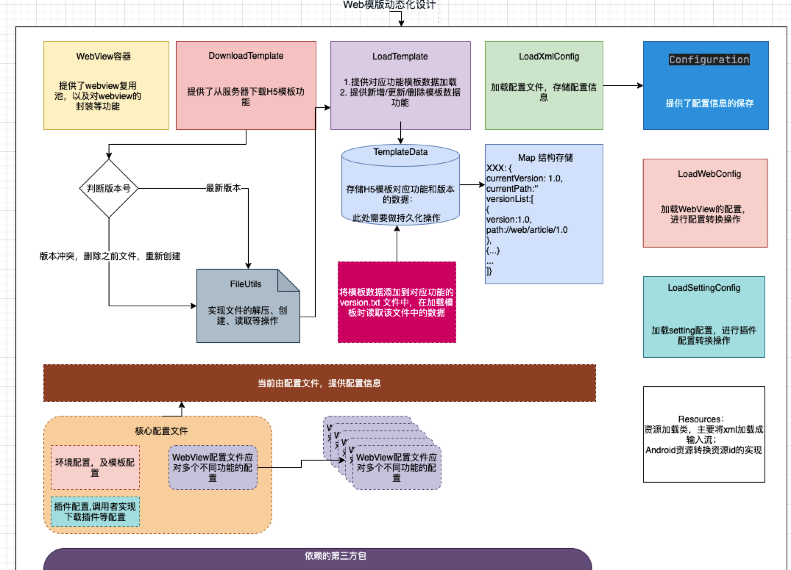
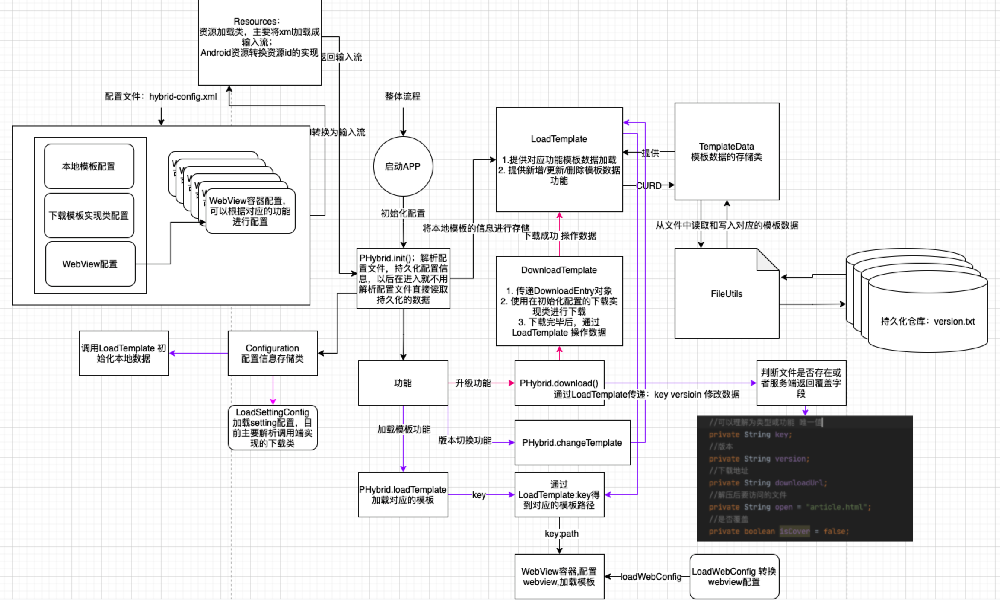
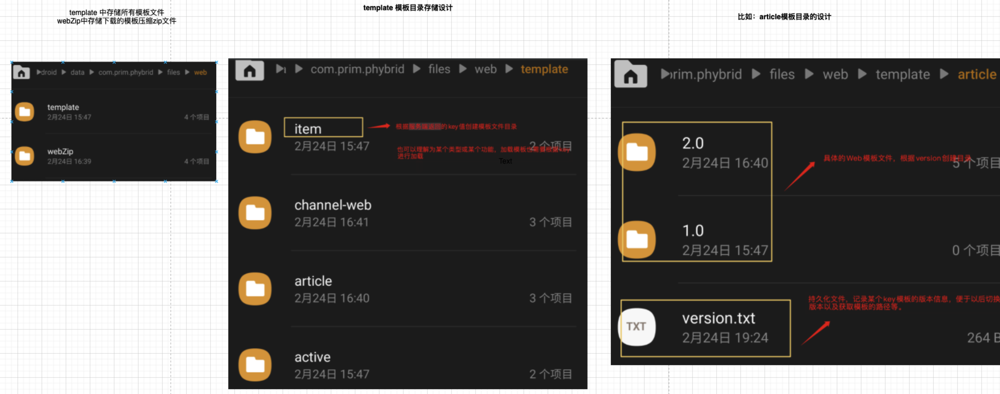
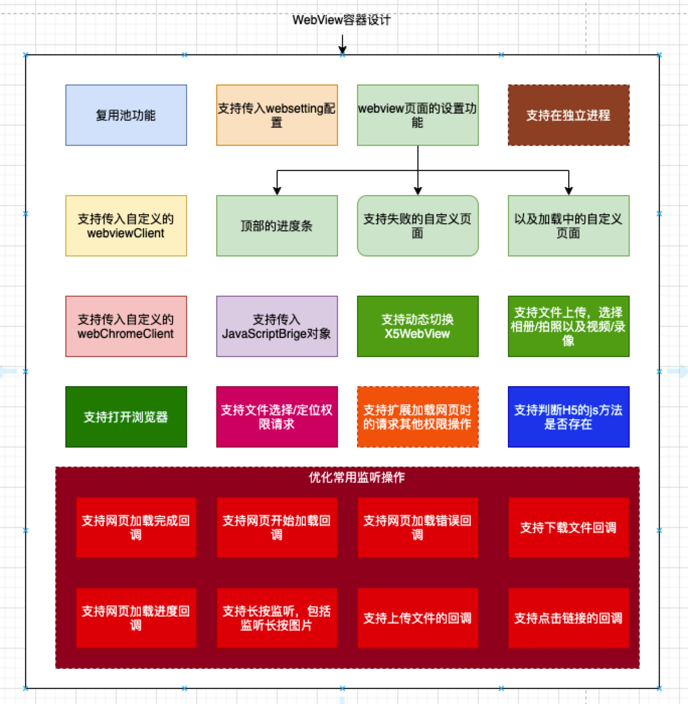

## Web 动态模板技术实现方案

> 实现Web模板动态加载

### 配置文件规则

在调用方的项目中，创建`main/resources` 目录

- 核心配置文件: `hybrid-config.xml`

```xml
<?xml version="1.0" encoding="UTF-8" ?>
<configuration>
    <!-- 环境配置，便于在开发环境下的测试 -->
    <environments default="debug">
        <!--develop  debug  prerelease release-->
        <environment id="debug">
            <!-- 添加初始化数据源配置 -->
            <dataSource>
                <!-- 默认模板配置 -->
                <property name="template">
                    <map>
                        <!-- 文章详情页模板 -->
                        <entry key="article" value="/android_asset/web/article/1.0/article.html" version="1.0" />
                        <!-- item模板 -->
                        <entry key="item" value="/android_asset/web/item/1.0/article.html" version="1.0" />
                        <!-- web频道模板 -->
                        <entry key="channel" value="/android_asset/web/channel-web/1.0/article.html" version="1.0" />
                    </map>
                </property>
            </dataSource>
        </environment>
    </environments>

    <!-- 插件相关的配置 -->
    <settings>
        <!-- 必须配置项 否则无法下载模板 下载模板的网络请求实现类 该类必须实现DownloadListener接口-->
        <setting name="downloadTemplate" value="com.prim.phybrid.DownloadTemplate" />
        <!-- 定义其他插件的实现 -->
    </settings>

    <!-- webview容器对应的配置映射文件信息，对应不同的功能有着不同的webview配置
     如果不设置将使用该库的默认配置
    -->
    <webviews>
        <!-- 默认的webview配置 -->
       <webview id="default" value="article-webview-config.xml" /> 
        <!-- 特有的webview配置 -->
        <webview value="article-webview-config.xml" />
        <webview value="channel-web-webview-config.xml" />
    </webviews>
</configuration>
```

webview的配置：需要创建xml配置文件，规则如下：

```xml
<?xml version="1.0" encoding="UTF-8" ?>
<!-- namespace 对应着相应的key -->
<webview-mapper namespace="article">
    <!-- webview的配置 -->
    <webview>
        <!-- webview 自定义容器类,必须实现IWebView接口，如果不设置会使用默认的primweb实现 -->
        <property name="container" value="" />
        <!-- webSetting 类 必须继承BaseAgentWebSetting -->
        <property name="webSetting" value="com.prim.phybrid.AndroidWebSettings" />
        <!-- webChromeClient类 必须实现 AgentChromeClient -->
        <property name="webChromeClient" value="" />
        <!-- WebViewClient类 必须实现 AgentWebViewClient -->
        <property name="webViewClient" value="" />
        <!-- 主要为primweb进行配置 ： Android、X5 -->
        <property name="webViewType" value="" />
        <!-- 监听js方法是否存在的全类 必须实现 CommonJSListener -->
        <property name="listenerCheckJsFunction" value="" />
        <!-- UI配置- -->
        <!-- 错误页面： value 是布局文件的名称：R.layout.error 直接填写error即可; clickId:错误页面点击某个view触发的点击事件，填写规则：R.id.text 直接写text即可 -->
        <property name="errorLayout" value="common_ui_view_net_error_status" clickId="text" />
        <!-- 加载页面 -->
        <property name="loadLayout" value="" />
        <!-- 是否启用顶部指示器 -->
        <property name="enableTopIndicator" value="false" />
        <!-- 顶部指示器的颜色和高度设置 -->
        <property name="topIndicator" colorInt="" height="" />
        <!-- javaScript桥接类 -->
        <property name="javaScriptBridge" value="" birdge="" />
    </webview>

    <!-- webview复用池的配置 -->
    <webpool>
        <!-- 配置是否开启复用池 -->
        <property name="enable" value="true" />
        <!-- webSetting的全类名 -->
        <property name="webPoolSetting" value="" />
        <!-- 定义复用池的个数 -->
        <property name="size" value="3" />
        <!-- class：桥接类的全类名 必须实现 IJavascriptInterface  bridge: 和js定义的桥接名称 -->
        <property name="poolJavaScriptBridge" value="" birdge="" />
        <!-- 复用池的webClient监听实现类 必须实现 OnWebClientListener -->
        <property name="webClientListener" value="" />
        <!-- 复用池的webChromeClientListener监听实现类 -->
        <property name="webChromeClientListener" value="" />
    </webpool>
</webview-mapper>
```

### 调用方必须实现 模板下载类，添加在配置文件中

```java
public class DownloadTemplate implements DownloadListener {
    @Override
    public void download(String url, String downloadPath, DownloadCallback callback) {
       // TODO 下载的具体实现
      
        // 下载成功的回调 PHybrid 会自动解压zip
        callback.onSuccess();
    }
}
```

添加在配置文件中:

```xml
    <!-- 插件相关的配置 -->
    <settings>
        <!-- 必须配置项 否则无法下载模板 下载模板的网络请求实现类 该类必须实现DownloadListener接口-->
        <setting name="downloadTemplate" value="com.prim.phybrid.DownloadTemplate" />
        <!-- 定义其他插件的实现 -->
    </settings>
```

### 初始化

```java
PHybrid.init(this, "hybrid-config.xml");
```

### 访问模板

```java
PHybrid.loadTemplate(this, "article", webContainer);
```

### 下载模板

```java
				DownloadEntry downloadEntry = new DownloadEntry();
        downloadEntry.setDownloadUrl("article");
        downloadEntry.setKey("article");
        downloadEntry.setVersion("2.0");
        PHybrid.download(downloadEntry);
```

### 切换模板版本

```java
 boolean change = PHybrid.changeTemplateVersion("article", "1.0");//切换模板
```








